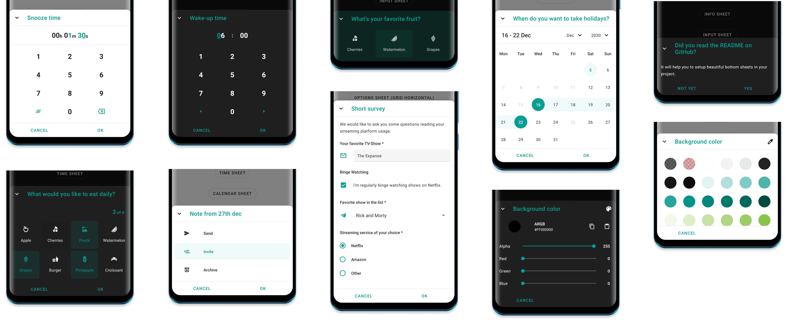
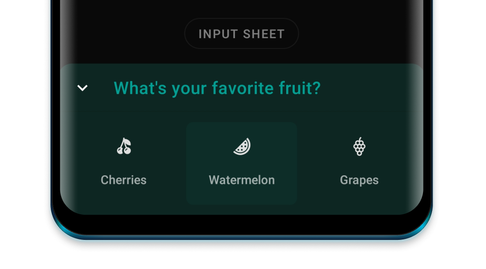

sheets
<div>

  

  # Sheets
  Offers a range of beautiful sheets (dialogs & bottom sheets) for quick use in your project.

  <div>
    <a href="https://github.com/maxkeppeler/sheets">
      
    </a>
    <a href="https://github.com/maxkeppeler/sheets/fork">
      
    </a>
    <a href="https://github.com/maxkeppeler/sheets">
      
    </a>
    <a href="https://github.com/maxkeppeler/">
      
    </a>
    <a href="https://twitter.com/maxkeppeler">
      
    </a>
  </div>

</div>

<br/>
<br/>
<br/>


<a href="https://www.codacy.com/gh/MaxKeppeler/sheets/dashboard?utm_source=github.com&amp;utm_medium=referral&amp;utm_content=MaxKeppeler/sheets&amp;utm_campaign=Badge_Grade">
  
</a>

<a href="https://opensource.org/licenses/Apache-2.0">
  
</a>

<br/>
<br/>

Get the [sample apk](https://github.com/MaxKeppeler/sheets/blob/main/sample/sample.apk) to see the all sheets in real.

## Table of Contents
- [Get started](#get-started)
  - [Info Sheet](#info)
  - [Options Sheet](#options)
  - [Clock Time Sheet](#clock-time)
  - [Time Sheet](#time)
  - [Input Sheet](#input)
  - [Calendar Sheet](#calendar)
  - [Color Sheet](#color)
  - [Custom Sheet](#custom)
  - [Lottie](#lottie)
  - [Appearance](#appearance)  
- [Misc](#misc)
  - [Showcase](#showcase)
  - [Support this project](#support-this-project)
  - [Credits](#credits)
  - [License](#license)

# Get started

In order to use any of the following Sheets, you have to implement the `core` module.

[  ](https://bintray.com/maximilian-keppeler/maven/sheets%3Acore/_latestVersion)

```gradle
dependencies {
  ...
  implementation 'com.maxkeppeler.sheets:core:<latest-version>'
}
```

**The following functions can be called from any sheet:**

Use ```style()``` to display the sheet as either a BottomSheet or dialog.<br/>
Use ```title()``` to set the title text.<br/>
Use ```titleColor()``` to set the title text color.<br/>
Use ```titleColorRes()``` to set the title text color with a color res.<br/>
Use ```topStyle()``` to display a cover image.<br/>
Use ```withCoverImage()``` to display a cover image.<br/>
Use ```withIconButton()``` to display up to 3 icon buttons.<br/>
Use ```displayCloseIconButton()``` to set a custom drawable for the close button.<br/>
Use ```displayCloseButton()``` to show or hide the close icon button.<br/>
Use ```displayHandle()``` to show or hide the handle.<br/>
Use ```behavior()``` to set the BottomSheetBehavior.<br/>
Use ```peekHeight()``` to set the peek height for the BottomSheet.<br/>
Use ```cornerRadius()``` to set corner radius.<br/>
Use ```cornerFamily()``` to set corner family (cut or rounded).<br/>
Use ```borderWidth()``` to set the width of the border width.<br/>
Use ```borderColor()``` to set the color of the border.<br/>
Use ```cancelableOutside()``` to disable dismissing the sheet when outside.<br/>
Use ```displayToolbar()``` to show or hide the toolbar of the sheet (close icon button, the title, the divider and icon buttons.).<br/>
Use ```onNegative()``` to set the negative button text and/ or the listener to be invoked when clicked.<br/>
Use ```onDismiss()``` to set a listener to be invoked when the sheet is dismissed.<br/>
Use ```show()``` to show the sheet.<br/>

Each of the sheets have an extension function called ```build``` and ```show``` where the receiver is the used sheet.<br/>

Use ```build``` to build a sheet and display it later.

```
val sheet = InfoSheet().build(context) {
  // build sheet
}

sheet.show() // Show sheet when ready
```
Use ```show``` if you want to build and then immediately display it.
```
InfoSheet().show(context) {
  // build sheet
} // Show sheet
```

## Info
[  ](https://bintray.com/maximilian-keppeler/maven/sheets%3Ainfo/_latestVersion)

The `Info` Sheet lets you display information or warning.

<details open>
<br/>
<br/>
<summary>Showcase as Dialog</summary>

<br/>
<br/>
<br/>
<br/>
</details>
</br>

<details>
<summary>Showcase as BottomSheet</summary>

<br/>
<br/>
<br/>
<br/>
<br/>
<br/>
</details>

```gradle
dependencies {
  ...
  implementation 'com.maxkeppeler.sheets:info:<latest-version>'
}
```

### Usage
For the default info sheet use it as following:
```
InfoSheet().show(context) {
  title("Do you want to install Awake?")
  content("Awake is a beautiful alarm app with morning challenges, advanced alarm management and more.")
  onNegative("No") {
    // Handle event
  }
  onPositive("Install") {
    // Handle event
  }
}
```

Use ```content()``` to set the content text.<br/>
Use ```drawable()``` to display a drawable left of the text.<br/>
Use ```drawableColor()``` to set the color of the drawable.<br/>

## Options
[  ](https://bintray.com/maximilian-keppeler/maven/sheets%3Aoptions/_latestVersion)

The `Options` Sheet lets you display a grid or list of options.

<details open>
<br/><br/>
<summary>Showcase as Dialog</summary>


</details>
</br>

<details>
<br/><br/>
<summary>Showcase as BottomSheet</summary>


</details>

<br/>
<details>
<br/><br/>
<summary>Showcase some variants as Dialogs</summary>

<br/>
<br/>
<br/>
</details>
</br>

<details>
<br/><br/>
<summary>Showcase some variants as BottomSheets</summary>

<br/>
<br/>
<br/>
</details>

```gradle
dependencies {
  ...
  implementation 'com.maxkeppeler.sheets:info:<latest-version>'
}
```

```gradle
dependencies {
  ...
  implementation 'com.maxkeppeler.sheets:options:<latest-version>'
}
```

### Usage
For the default options sheet use it as following:
```
OptionsSheet().show(context) {
  title("Text message")
  with(
    Option(R.drawable.ic_copy, "Copy"),
    Option(R.drawable.ic_translate, "Translate"),
    Option(R.drawable.ic_paste, "Paste")
  )
  onPositive { index: Int, option: Option ->
    // Handle selected option
  }
}
```

Use ```multipleChoices()``` to select multiple options.<br/>
Use ```showMultipleChoicesInfo()``` to display min and max amount of choices and current selection.<br/>
Use ```maxChoicesStrictLimit()``` prevents the user to select more choices than allowed.<br/>
Use ```minChoices()``` to set the minimum amount of choices.<br/>
Use ```maxChoices()``` to set the maximum amount of choices.<br/>
Set a listener with ```onPositiveMultiple()``` for multiple choices data.<br/>
Use ```showButtons()``` to show the buttons and require a positive button click.<br/>
Use ```displayMode()``` to either display it as a list, a vertical or horizontal growing scrollable grid.<br/>

**Option Object**
Use ```selected()``` to preselect an option.
Use ```disable()``` to disable an option.

Notice: Preselected options automatically increase the current selection while disabled options decrease the maximum amount of choices.


## Clock Time
[  ](https://bintray.com/maximilian-keppeler/maven/sheets%3Atime-clock/_latestVersion)

The `Clock Time` Sheet lets you quickly pick a time.

<details>
<br/><br/>
<summary>Showcase as Dialog</summary>


</details>
</br>

<details open>
<br/><br/>
<summary>Showcase as BottomSheet</summary>


</details>

```gradle
dependencies {
  ...
  implementation 'com.maxkeppeler.sheets:time-clock:<latest-version>'
}
```

### Usage
For the default clock time sheet, in 24-hours format, use it as following:
```
ClockTimeSheet().show(context) {
  title("Wake-up time")
  onPositive { clockTimeInMillis: Long ->
    // Handle selected time
  }
}
```

Use ```format24Hours()``` to choose between the 24-hours or 12-hours format.<br/>
Use ```currentTime()``` to set the current time in milliseconds.<br/>

## Time
[  ](https://bintray.com/maximilian-keppeler/maven/sheets%3Atime/_latestVersion)

The `Time` Sheet lets you pick a duration time in a specific format.

<details open>
<br/><br/>
<summary>Showcase as Dialog</summary>


</details>
</br>

<details>
<br/><br/>
<summary>Showcase as BottomSheet</summary>


</details>

```gradle
dependencies {
  ...
  implementation 'com.maxkeppeler.sheets:time:<latest-version>'
}
```

### Usage
For the default time sheet use it as following:
```
TimeSheet().show(context) {
  title("Snooze time")
  onPositive { durationTimeInMillis: Long ->
    // Handle selected time
  }
}
```
Use ```format()``` to select the time format. (e. g. HH:mm:ss, mm:ss, ...) <br/>
Use ```currentTime()``` to set the current time in seconds.<br/>
Use ```minTime()``` to set the minimum time.<br/>
Use ```maxTime()``` to set the maximum time.<br/>

## Input
[  ](https://bintray.com/maximilian-keppeler/maven/sheets%3Ainput/_latestVersion)

The `Input` Sheet lets you display a form consisting of various inputs.

<details>
<br/><br/>
<summary>Showcase as Dialog</summary>


</details>
</br>

<details open>
<br/><br/>
<summary>Showcase as BottomSheet</summary>


</details>

<br/>
<details>
<br/><br/>
<summary>Showcase some variants as Dialogs</summary>

<br/>
</details>
</br>

<details>
<br/><br/>
<summary>Showcase some variants as BottomSheets</summary>


</details>

```gradle
dependencies {
  ...
  implementation 'com.maxkeppeler.sheets:input:<latest-version>'
}
```

### Usage
For the default input sheet use it as following:
```
InputSheet()).show(context) {
    title("Short survey")
    content("We would like to ask you some questions reading your streaming platform usage.")
  with(InputEditText {
    required())
    label("Your favorite TV-Show")
    hint("The Mandalorian, ...")
    validationListener { value -> } // Add custom validation logic
    changeListener { value -> } // Input value changed
    resultListener { value -> } // Input value changed when form finished
  })
  with(InputCheckBox("binge_watching") { // Read value later by index or custom key from bundle
    label("Binge Watching")
    text("I'm regularly binge watching shows on Netflix.")
    // ... more options
  })
  with(InputRadioButtons() {
    required()
    label("Streaming service of your choice")
    options(mutableListOf("Netflix", "Amazon", "Other"))
  })
  // ... more input options
  onNegative { showToast("InputSheet cancelled", "No result") }
  onPositive { result ->
      showToastLong("InputSheet result", result.toString())
      val text = result.getString("0") // Read value of inputs by index
      val check = result.getBoolean("binge_watching") // Read value by passed key
  }
}
```
**Supported Input options:**

For now you can use ```InputEditText, InputCheckBox, InputRadioButtons, InputSpinner```. <br/>

Use ```content()``` to add a content text (e. g. to explain the form).<br/>

**Common configs are:**<br/>
Use ```label()``` to set text of the input label.<br/>
Use ```drawable()``` to set drawable of the input.<br/>
Use ```required()``` to enforce that the user inputs value. By default, no input is required.<br/>
Use ```changeListener()``` to observe a change of the value.<br/>
Use ```resultListener()``` to receive the final value. (Or use the bundled data result listener.)<br/>

**InputEditText**<br/>
Use ```hint()``` to set text hint.<br/>
Use ```defaultValue()``` to set default text.<br/>
Use ```inputType()``` to set the ```android.text.InputType```'s.<br/>
Use ```inputFilter()``` to set the ```android.text.inputFilter```.<br/>
Use ```maxLines()``` to set the max amount of lines.<br/>
Use ```endIconMode()``` to set TextInputLayout.EndIconMode.<br/>
Use ```endIconActivated()``` to set the EndIcon activated.<br/>
Use ```passwordVisible()``` to initially make the password visible or invisible.<br/>
Use ```validationListener()``` to validate the text input with your own logic.<br/>

**InputCheckBox** <br/>
Use ```text()``` to set the CheckBox text.<br/>
Use ```defaultValue()``` to set default value.

**InputRadioButtons** <br/>
Use ```options()``` to add an amount of RadioButtons.<br/>
Use ```selected()``` to set selected index.<br/>

**InputSpinner** <br/>
Use ```noSelectionText()``` to set the text for the Spinner view, when nothing is selected.<br/>
Use ```options()``` to add an amount of SpinnevalidatrItems.<br/>
Use ```selected()``` to set selected index.<br/>

## Calendar
[  ](https://bintray.com/maximilian-keppeler/maven/sheets%3Acalendar/_latestVersion)

The `Calendar` Sheet lets you pick a date or date range. This type was build using the library [CalendarView](https://github.com/kizitonwose/CalendarView).

<details open>
<br/><br/>
<summary>Showcase as Dialog</summary>


</details>
</br>

<details>
<br/><br/>
<summary>Showcase as BottomSheet</summary>


</details>


```gradle
dependencies {
  ...
  implementation 'com.maxkeppeler.sheets:calendar:<latest-version>'
}
```

### Usage
For the default time sheet use it as following:
```
CalendarSheet().show(this) { // Build and show
  title("What's your date of birth?") // Set the title of the sheet
  onPositive { dateStart, dateEnd ->
    // Handle date or range
  }
```
Use ```selectionMode()``` to choose the selection mode (date or range).<br/>
Use ```calendarMode()``` to choose the calendar mode (week with various rows or month-view).<br/>
Use ```disableTimeline()``` to disable either past or future dates.<br/>
Use ```rangeYears()``` to set the range of years into past and future.<br/>
Use ```disable()``` to pass a ```Calendar``` object to disable various dates for selection.<br/>
Use ```showButtons()``` to show or hide the buttons view.<br/>

## Color
[  ](https://bintray.com/maximilian-keppeler/maven/sheets%3Acolor/_latestVersion)

The `Color` Sheet lets you pick a color. Display the default material colors or specify which colors can be choosen from. You can allow to chose a custom color as well.

<details>
<br/><br/>
<summary>Showcase as Dialog</summary>

<br/>

</details>
</br>

<details open>
<br/><br/>
<summary>Showcase as BottomSheet</summary>

<br/>

</details>

```gradle
dependencies {
  ...
  implementation 'com.maxkeppeler.sheets:color:<latest-version>'
}
```

### Usage
For the default color sheet use it as following:
```
ColorSheet().show(context) {
  title("Background color")
  onPositive { color ->
    // Use color
  }
}
```
Use ```defaultView()``` to select the default color view (Colors from templates or custom).<br/>
Use ```disableSwitchColorView()``` to disable switching between color views. Default view will only be shown.<br/>
Use ```defaultColor()``` to set default selected color.<br/>
Use ```colors()``` to pass all colors to be displayed in the color templates view.<br/>
Use ```disableAlpha()``` to disable alpha colors for custom colors.<br/>

## Custom

With just the 'core' module you are able to create your own sheet based on this library. You can use some components and styles within your own custom sheet automatically. By default the buttons and toolbar view with logic is ready to be used by your own implementation.

<details>
<br/><br/>
<summary>Showcase as Dialog</summary>


</details>
</br>

<details open>
<br/><br/>
<summary>Showcase as BottomSheet</summary>


</details>


```gradle
dependencies {
  ...
  implementation 'com.maxkeppeler.sheets:core:<latest-version>'
}
```

### Get started

You can find a custom sheet implementation in the sample module.

**For the default color sheet use it as following:**

1. Step: Create a class and extend from the class ``Sheet``.
```
class CustomSheet : Sheet() {
```
2. Step: Implement the method: ``onCreateLayoutView`` and pass your custom layout.
```
override fun onCreateLayoutView(): View {
    return LayoutInflater.from(activity).inflate(R.layout.sheets_custom, null)
}
```

All of the base functionality can be used and on top of that you can extend the logic and behavior as you wish.

### Components
You are free to use the components this library uses for it's sheet types.
- ```SheetTitle```
- ```SheetContent```
- ```SheetDigit```
- ```SheetNumericalInput```
- ```SheetDivider```
- ```SheetButton```
- ```SheetEdit```
- ```SheetRecyclerView```
- ```SheetValue```

More will be added over time.

## Lottie
[  ](https://bintray.com/maximilian-keppeler/maven/sheets%3Alottie/_latestVersion)

The `Lottie` modules gives you the ability to use a [Lottie animations](https://airbnb.design/lottie/) as cover view.

<details open>
<br/>
<br/>
<summary>Showcase as Dialog</summary>


</details>
</br>

<details>
<summary>Showcase as BottomSheet</summary>

<br/>
<br/>

</details>

```gradle
dependencies {
  ...
  implementation 'com.maxkeppeler.sheets:lottie:<latest-version>'
}
```

### Usage
You can use the Lottie animation as a cover for any type of sheet.
```
InfoSheet().show(this) {
  title("Team Collaboration")
  content("In the world of software projects, it is inevitable...")
  ...
  withCoverLottieAnimation(LottieAnimation {
    setAnimation(R.raw.anim_lottie_business_team)
    ... Setup Lottie animation
  })
  ...
}
```

Use ```playCoverAnimation()``` to play the animation.<br/>
Use ```resumeCoverAnimation()``` to resume the animation.<br/>
Use ```pauseCoverAnimation()``` to pause the animation.<br/>
Use ```cancelCoverAnimation()``` to cancel the animation.<br/>

## Appearance
By default, the library switches to either day or night mode depending on the attr ```textColorPrimary```.
By default it uses the activity's colorPrimary. The default ```highlightColor``` is generated based on the color ```sheetPrimaryColor```, or if not available ```colorPrimary```.



### Base
You want a different sheet background shape?
Then just override the corner family and radius.
```
<item name="sheetCornerRadius">12dp</item>
<item name="sheetCornerFamily">cut</item>
```
Just overwrite the base colors, if you want to achieve a different look of the sheets than your app.
```
<item name="sheetPrimaryColor">@color/customPrimaryColor</item>
<item name="sheetHighlightColor">@color/customHighlightColor</item>
<item name="sheetBackgroundColor">@color/customBackgroundColor</item>
<item name="sheetDividerColor">@color/customDividerColor</item>
<item name="sheetIconsColor">@color/customIconsColor</item>

```
You can override the basic style of a sheet. Instead of displaying the toolbar, you can just hide it and display the typical handle.
```
<item name="sheetDisplayHandle">true</item>
<item name="sheetDisplayToolbar">false</item>
<item name="sheetDisplayCloseButton">false</item>
```
Change the appearance of the title.
```
<item name="sheetTitleColor">@color/customTitleTextColor</item>
<item name="sheetTitleFont">@font/font</item>
<item name="sheetTitleLineHeight">@dimen/dimen</item>
<item name="sheetTitleLetterSpacing">value</item>
```
Change the appearance of the content text.
```
<item name="sheetContentColor">@color/customContentTextColor</item>
<item name="sheetContentInverseColor">@color/customContentTextInverseColor</item>
<item name="sheetContentFont">@font/font</item>
<item name="sheetContentLineHeight">@dimen/dimen</item>
<item name="sheetContentLetterSpacing">value</item>
```
Change the appearance of the value texts. (e.g. the time in the TimeSheet &amp; ClockTimeSheet or the selected date &amp; period in the Calendarsheet.)
```
<item name="sheetValueTextActiveColor">@color/customValueTextColor</item>
<item name="sheetValueFont">@font/font</item>
<item name="sheetValueLineHeight">@dimen/dimen</item>
<item name="sheetValueLetterSpacing">value</item>
```
Change the appearance of the digit keys on the numerical input.
```
<item name="sheetDigitColor">@color/customDigitTextColor</item>
<item name="sheetDigitFont">@font/font</item>
<item name="sheetDigitLineHeight">@dimen/dimen</item>
<item name="sheetDigitLetterSpacing">value</item>
```
### Buttons
Override the appearance of the button text.
```
<item name="sheetButtonTextFont">@font/font</item>
<item name="sheetButtonTextLetterSpacing">value</item>
```
Override the general appearance of the buttons (negative and positive button).
```
<item name="sheetButtonColor">@color/customButtonColor<item>
<item name="sheetButtonTextFont">@font/font<item>
<item name="sheetButtonTextLetterSpacing">value<item>
<item name="sheetButtonCornerRadius">12dp<item>
<item name="sheetButtonCornerFamily">cut<item>
<item name="sheetButtonWidth">match_content/wrap_content<item>
```
Override the appearance of the negative button.

```
<item name="sheetNegativeButtonType">text_button/outlined_button/button<item>
<item name="sheetNegativeButtonCornerRadius">12dp<item>
<item name="sheetNegativeButtonCornerFamily">cut<item>
```
Override the appearance of the positive button.
```
<item name="sheetPositiveButtonType">text_button/outlined_button/button<item>
<item name="sheetPositiveButtonCornerRadius">12dp<item>
<item name="sheetPositiveButtonCornerFamily">cut<item>
```
The corner family and radius is applied to the button shape or in the case of a outlined or text button, to the ripple background shape.

**Fine control**
You can even define the corner family and radius of the negative and positive button for each corner.
```
<item name="sheetNegativeButtonBottomLeftCornerRadius">4dp<item>
<item name="sheetNegativeButtonBottomLeftCornerFamily">cut<item>
...
<item name="sheetPositiveButtonBottomRightCornerRadius">8dp<item>
<item name="sheetPositiveButtonBottomRightCornerFamily">rounded<item>
```

### Handle
The size and the appearance of the handle can be changed like this:
```
<item name="sheetHandleCornerRadius">8dp</item>
<item name="sheetHandleCornerFamily">rounded</item>
<item name="sheetHandleFillColor">?sheetPrimaryColor</item>
<item name="sheetHandleBorderColor">?sheetPrimaryColor</item>
<item name="sheetHandleBorderWidth">1dp</item>
<item name="sheetHandleWidth">42dp</item>
<item name="sheetHandleHeight">4dp</item>
```

### OptionsSheet
Override appearance of selected options.
```
<item name="sheetOptionSelectedImageColor">@color/customSelectedOptionImageColor</item>
<item name="sheetOptionSelectedTextColor">@color/customSelectedOptionTextColor</item>
```
Override appearance of disabled options.
```
<item name="sheetOptionDisabledImageColor">@color/customDisabledOptionImageColor</item>
<item name="sheetOptionDisabledTextColor">@color/customDisabledOptionImageColor</item>
<item name="sheetOptionDisabledBackgroundColor">@color/customDisabledOptionBackgColor</item>
```

### InputSheet

Override the appearance of the TextInputLayout (used for the InputEditText).
```
<item name="sheetTextInputLayoutCornerRadius">12dp</item>
<item name="sheetTextInputLayoutBottomLeftCornerRadius">12dp</item>
... and for all other corners
<item name="sheetTextInputLayoutEndIconColor">@color/customEndIconColor</item>
<item name="sheetTextInputLayoutHelperTextColor">@color/customHelperTextColor</item>
<item name="sheetTextInputLayoutBoxStrokeColor">@color/customBoxStrokeColor</item>
<item name="sheetTextInputLayoutHintTextColor">@color/customHintTextColor</item>
<item name="sheetTextInputLayoutBoxStrokeErrorColor">@color/customBoxStrokeErrorColor</item>
<item name="sheetTextInputLayoutErrorTextColor">@color/customErrorTextColor</item>
```

# Misc

## Showcase
Check out some real apps which use this library.<br/>
Feel free to hit me up to include your app here.

- [Sign for Spotify](https://play.google.com/store/apps/details?id=com.mk.sign.spotifyv2) - Playlist and control widgets for Spotify on your home screen. (Uses: ```Info```, ```Options```, ```Input```, ```Color```)

- [Buddha Quotes](https://play.google.com/store/apps/details?id=org.bandev.buddhaquotes) - A collaborative project to create a Free and Open Source Buddha Quotes app for Android with a focus on privacy. (Uses: ```Options```, ```Input```, ```Color```, ```Time```)

## Support this project

- Leave a **Star** and tell other devs about it.

- **Watch** for updates and improvements.

- **[Open an issue](https://github.com/MaxKeppeler/sheets/issues/)** if you see or got any error.

- Leave your thanks [here](https://github.com/MaxKeppeler/sheets/discussions/categories/show-and-tell) and showcase your implementation.

## Motivation
I created several sheets for my apps [Sign for Spotify](https://play.google.com/store/apps/details?id=com.mk.sign.spotifyv2) and [Awake](https://play.google.com/store/apps/details?id=com.mk.awake) in the recent months.
I especially wanted to have a 'writable' clock time and duration time picker in form of a sheet
This is my first library - I'm happy about any feedback, tips etc. I hope you like it and can make use of it. :)

## Credits
- Thanks to [Sasikanth](https://github.com/msasikanth). I got some inspiration for the sheet appearance through his [Color Sheet](https://github.com/msasikanth/ColorSheet) library, as well as his note taking app [Memoire](https://play.google.com/store/apps/details?id=com.primudesigns.stories).
- Thanks to [Aidan Follestad](https://github.com/afollestad) and his [material-dialogs](https://github.com/afollestad/material-dialogs) library. I originally wanted to offer all sheets through one library. I got inspired of his project to split the different sheets into different modules/ libraries.

## License
```
Copyright 2020 Maximilian Keppeler https://maxkeppeler.com

Licensed under the Apache License, Version 2.0 (the "License");
you may not use this file except in compliance with the License.
You may obtain a copy of the License at

   http://www.apache.org/licenses/LICENSE-2.0

Unless required by applicable law or agreed to in writing, software
distributed under the License is distributed on an "AS IS" BASIS,
WITHOUT WARRANTIES OR CONDITIONS OF ANY KIND, either express or implied.
See the License for the specific language governing permissions and
limitations under the License.
```
