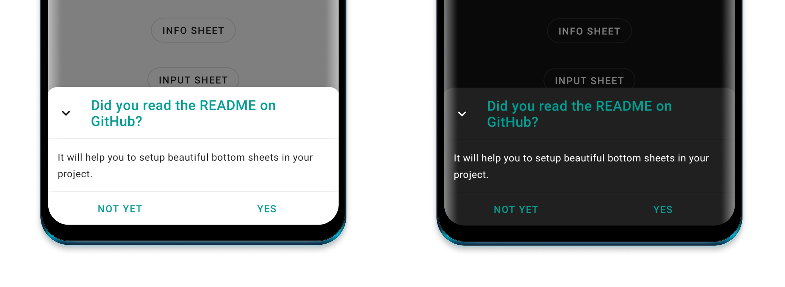
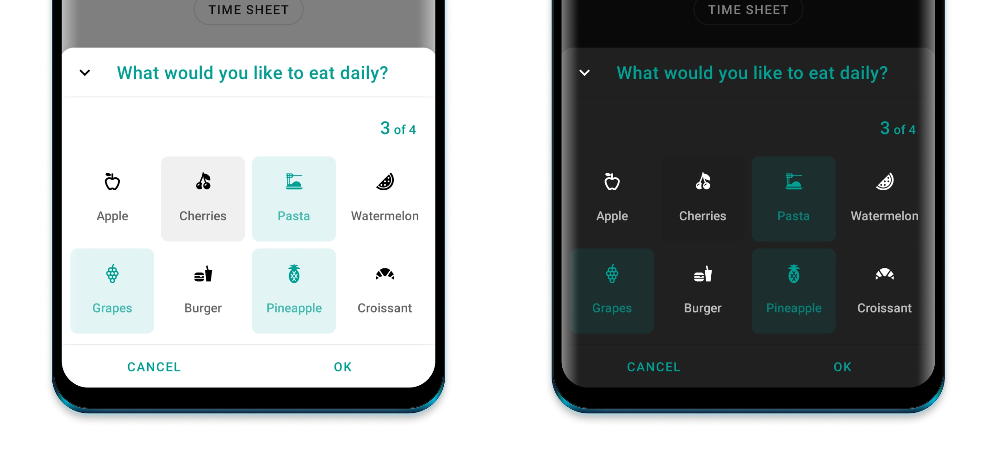
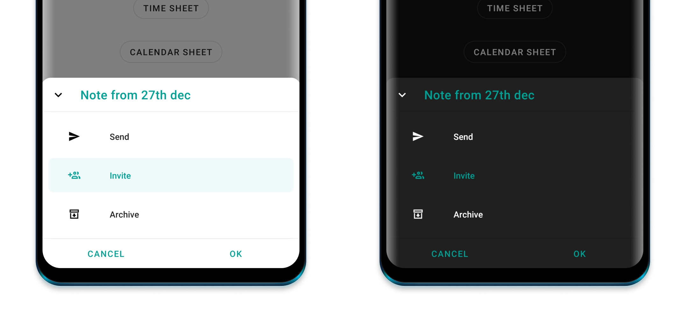
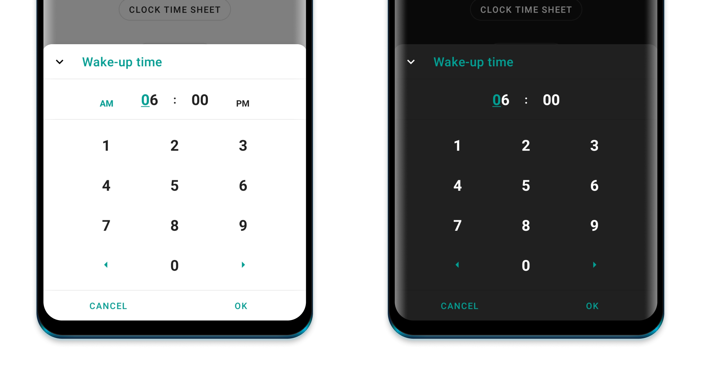
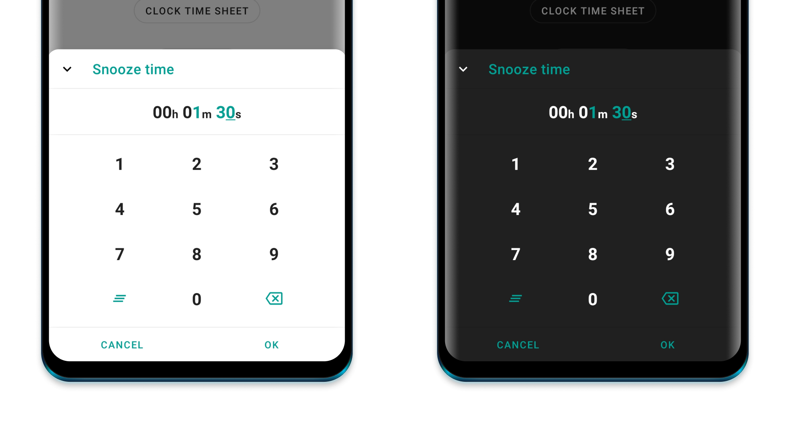
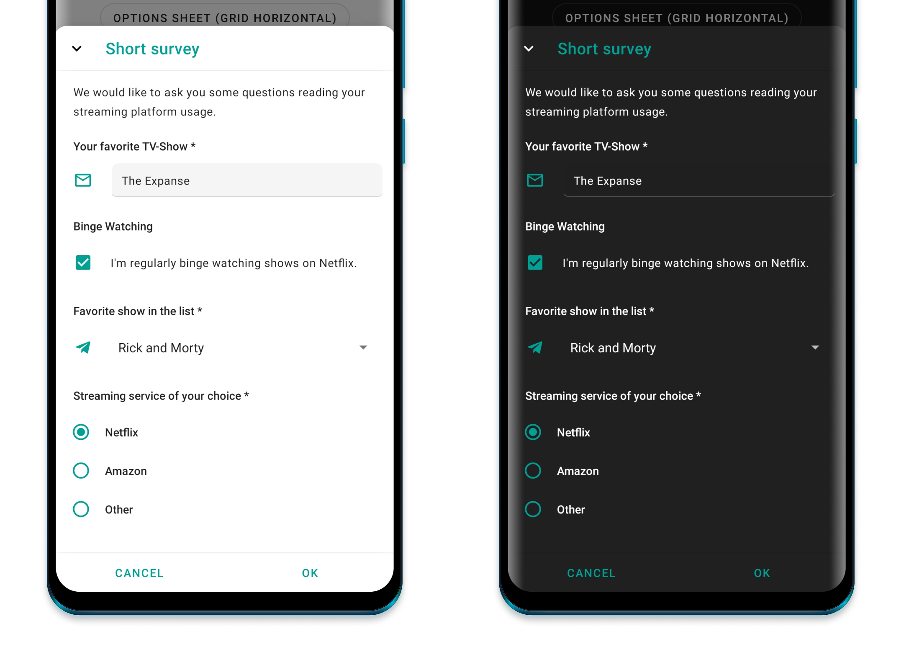
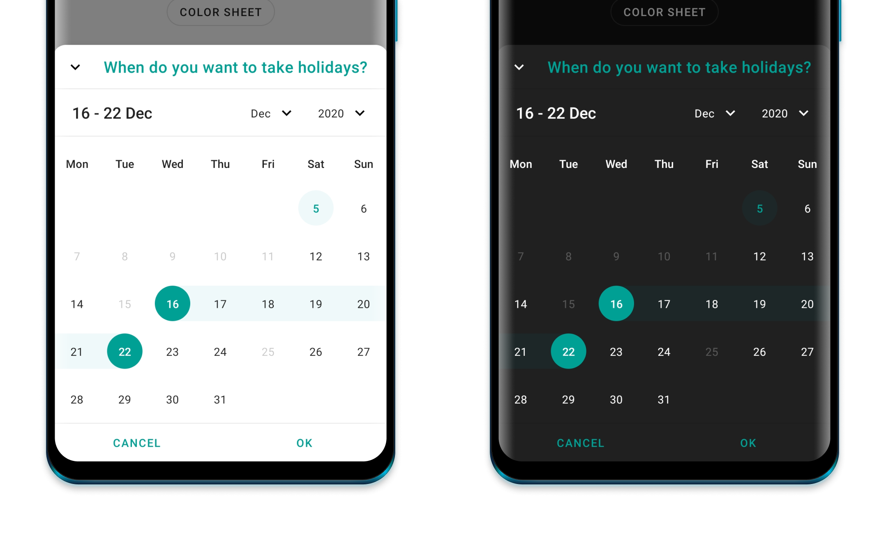
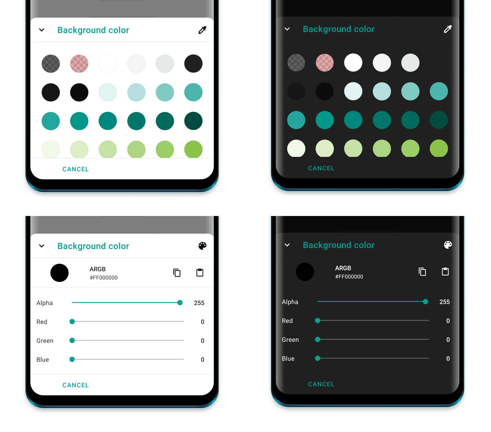

<div>

  

  # Bottom Sheets
  Offering a range of beautiful bottom sheets for quick use in your project.
</div>

<div>
  <a href="https://github.com/maxkeppeler/bottom-sheets">
    
  </a>
  <a href="https://github.com/maxkeppeler/bottom-sheets/fork">
    
  </a>
  <a href="https://github.com/maxkeppeler/bottom-sheets">
    
  </a>
  <a href="https://github.com/maxkeppeler/">
    
  </a>
  <a href="https://twitter.com/maxkeppeler">
    
  </a>
</div>

<br/>
<br/>
<br/>


## Table of Contents
-  [Get started](#get-started)
  - [Appearance](#appearance)
  - [Info Bottom Sheet](#info)
  - [Options Bottom Sheet](#options)
  - [Clock Time Bottom Sheet](#clock-time)
  - [Time Bottom Sheet](#time)
  - [Input Bottom Sheet](#input)
  - [Calendar Sheet](#calendar-sheet)
  - [Color Bottom Sheet](#color)
- [Other](#other)
  - [Showcase](#showcase)
  - [Support this project](#support-this-project)
  - [Credits](#credits)
  - [License](#license)

# Get started

In order to use any of the following Bottom Sheets, you have to implement the `core` module.

[  ](https://bintray.com/maximilian-keppeler/maven/bottom-sheets%3Acore/_latestVersion)

```gradle
dependencies {
  ...
  implementation 'com.maxkeppeler.bottom-sheets:core:1.0.0'
}
```

**The following functions can be called from any bottom sheet:**

Use ```cancelableOutside()``` to disable dismissing the bottom sheet when outside ‚
Use ```state()``` to set the BottomSheetBehavior state.‚
Use ```peekHeight()``` to set the peek height for the bottom sheet.
Use ```cornerRadius()``` to set corner radius.
Use ```cornerFamily()``` to set corner family (cut or rounded).
Use ```borderWidth()``` to set the width of the border width.
Use ```borderColor()``` to set the color of the border.
Use ```hideToolbar()``` to hide the toolbar of the bottom sheet (close icon button, the title and the divider).
Use ```hideCloseButton()``` to hide the close icon button.
Use ```title()``` to set the title text.
Use ```onNegative()``` to set the negative button text and/ or the listener to be invoked when clicked.
Use ```onDismiss()``` to set a listener to be invoked when the bottom sheet is dismissed.
Use ```addBottomSheetCallback()``` to add a bottom sheet callback.
Use ```show()``` to show the bottom sheet.<br/>

Each of the bottom sheets have an extension function called ```build``` and ```show``` where the receiver is the used bottom sheet.<br/>

Use ```build``` to build a bottom sheet and display it later.

```
val sheet = InfoSheet().build(context) {
  // build bottom sheet
}

sheet.show() // Show bottom sheet when ready
```
Use ```show``` if you want to build and then immediately display it.
```
InfoSheet().show(context) {
  // build bottom sheet
} // Show bottom sheet
```

## Appearance
By default, the library switches to either day or night mode depending on the attr textColorPrimary.
By default it uses the activity's colorPrimary and colorControlHighlight for the primary color and the highlights of the bottom sheets.


Recommended styles to overwrite:
```
<item name="bottomSheetPrimaryColor">@color/customPrimaryColor</item>
<item name="bottomSheetHighlightColor">@color/customHighlightColor</item>
```

Further things you can change or override:
```
<item name="bottomSheetBackgroundColor">@color/customBackgroundColor</item>
<item name="bottomSheetIconsColor">@color/customIconsColor</item>

Specific for OptionsSheet
<item name="bottomSheetOptionActiveImageColor">@color/customActiveOptionImageColor</item>
<item name="bottomSheetOptionActiveTextColor">@color/customActiveOptionTextColor</item>

Specific for title text
<item name="bottomSheetTitleColor">@color/customTitleTextColor</item>
<item name="bottomSheetTitleFont">@font/font</item>
<item name="bottomSheetTitleLineHeight">@dimen/dimen</item>
<item name="bottomSheetTitleLetterSpacing">value</item>

Specific for content text
<item name="bottomSheetContentColor">@color/customContentTextColor</item>
<item name="bottomSheetContentFont">@font/font</item>
<item name="bottomSheetContentLineHeight">@dimen/dimen</item>
<item name="bottomSheetContentLetterSpacing">value</item>

Specific for value Text (TimeSheet, ClockTimeSheet, CalendarSheet)
<item name="bottomSheetValueTextActiveColor">@color/customValueTextColor</item>
<item name="bottomSheetValueFont">@font/font</item>
<item name="bottomSheetValueLineHeight">@dimen/dimen</item>
<item name="bottomSheetValueLetterSpacing">value</item>

Specific for digit text
<item name="bottomSheetDigitColor">@color/customDigitTextColor</item>
<item name="bottomSheetDigitFont">@font/font</item>
<item name="bottomSheetDigitLineHeight">@dimen/dimen</item>
<item name="bottomSheetDigitLetterSpacing">value</item>

Specific for button text
<item name="bottomSheetButtonTextColor">@color/customButtonTextColor</item>
<item name="bottomSheetButtonTextFont">@font/font</item>
<item name="bottomSheetButtonTextLetterSpacing">value</item>

```


## Info
[  ](https://bintray.com/maximilian-keppeler/maven/bottom-sheets%3Ainfo/_latestVersion)

The `Info` Bottom Sheet lets you display information or warning.



```gradle
dependencies {
  ...
  implementation 'com.maxkeppeler.bottom-sheets:info:1.0.0'
}
```

### Usage
For the default info sheet use it as following:
```
InfoSheet().show(context) {
  title("Do you want to install Awake?")
  content("Awake is a beautiful alarm app with morning challenges, advanced alarm management and more.")
  onNegative("No") {
    // Handle event
  }
  onPositive("Install") {
    // Handle event
  }
}
```

## Options
[  ](https://bintray.com/maximilian-keppeler/maven/bottom-sheets%3Aoptions/_latestVersion)

The `Options` Bottom Sheet lets you display a grid or list of options.



```gradle
dependencies {
  ...
  implementation 'com.maxkeppeler.bottom-sheets:options:1.0.0'
}
```

### Usage
For the default options sheet use it as following:
```
OptionsSheet().show(context) {
  title("Text message")
  with(
    Option(R.drawable.ic_copy, "Copy"),
    Option(R.drawable.ic_translate, "Translate"),
    Option(R.drawable.ic_paste, "Paste")
  )
  onPositive { index: Int, option: Option ->
    // Handle selected option
  }
}
```

Use ```multipleChoices()``` to select multiple options.
Use ```showMultipleChoicesInfo()``` to display min and max amount of choices and current selection.
Use ```maxChoicesStrictLimit()``` prevents the user to select more choices than allowed.
Use ```minChoices()``` to set the minimum amount of choices.
Use ```maxChoices()``` to set the maximum amount of choices.
Set a listener with ```onPositiveMultiple()``` for multiple choices data.
Use ```showButtons()``` to show the buttons and require a positive button click. <br/>
Use ```displayMode()``` to either display it as a list, a vertical or horizontal growing scrollable grid.



**Option Object**
Use ```selected()``` to preselect an option.
Use ```disable()``` to disable an option.

Notice: Preselected options automatically increase the current selection while disabled options decrease the maximum amount of choices.


## Clock Time
[  ](https://bintray.com/maximilian-keppeler/maven/bottom-sheets%3Atime_clock/_latestVersion)

The `Clock Time` Bottom Sheet lets you quickly pick a time.



```gradle
dependencies {
  ...
  implementation 'com.maxkeppeler.bottom-sheets:clock-time:1.0.0'
}
```

### Usage
For the default clock time sheet, in 24-hours format, use it as following:
```
ClockTimeSheet().show(context) {
  title("Wake-up time")
  onPositive { clockTimeInMillis: Long ->
    // Handle selected time
  }
}
```

Use ```format24Hours()``` to choose between the 24-hours or 12-hours format.
Use ```currentTime()``` to set the current time in milliseconds.

## Time
[  ](https://bintray.com/maximilian-keppeler/maven/bottom-sheets%3Atime/_latestVersion)

The `Time` Bottom Sheet lets you pick a duration time in a specific format.



```gradle
dependencies {
  ...
  implementation 'com.maxkeppeler.bottom-sheets:time:1.0.0'
}
```

### Usage
For the default time sheet use it as following:
```
TimeSheet().show(context) {
  title("Snooze time")
  onPositive { durationTimeInMillis: Long ->
    // Handle selected time
  }
}
```
Use ```format()``` to select the time format. (e. g. HH:mm:ss, mm:ss, ...)
Use ```currentTime()``` to set the current time in seconds.
Use ```minTime()``` to set the minimum time.
Use ```maxTime()``` to set the maximum time.

## Input
[  ](https://bintray.com/maximilian-keppeler/maven/bottom-sheets%3Ainput/_latestVersion)

The `Input` Bottom Sheet lets you display a form consisting of various inputs.



```gradle
dependencies {
  ...
  implementation 'com.maxkeppeler.bottom-sheets:input:1.0.0'
}
```

### Usage
For the default input sheet use it as following:
```
InputSheet()).show(context) {
    title("Short survey")
    content("We would like to ask you some questions reading your streaming platform usage.")
  with(InputEditText {
    required())
    label("Your favorite TV-Show")
    hint("The Mandalorian, ...")
    changeListener { value -> } // Input value changes
    resultListener { value -> } // Input value changed when form finished
  })
  with(InputCheckBox("binge_watching") { // Read value later by index or custom key from bundle
    label("Binge Watching")
    text("I'm regularly binge watching shows on Netflix.")
    // ... more options
  })
  with(InputRadioButtons() {
    required()
    label("Streaming service of your choice")
    options(mutableListOf("Netflix", "Amazon", "Other"))
  })
  // ... more input options
  onNegative { showToast("InputSheet cancelled", "No result") }
  onPositive { result ->
      showToastLong("InputSheet result", result.toString())
      val text = result.getString("0") // Read value of inputs by index
      val check = result.getBoolean("binge_watching") // Read value by passed key
  }
}
```
**Supported Input options:**

For now you can use ```InputEditText, InputCheckBox, InputRadioButtons, InputSpinner```. <br/>
Use ```content()``` to add a content text (e. g. to explain the form).<br/>

**Common configs are:**

Use ```label()``` to set text of the input label.
Use ```drawable()``` to set drawable of the input.
Use ```required()``` to enforce that the user inputs value. By default, no input is required.


Use ```changeListener()``` to observe a change of the value.
Use ```resultListener()``` to receive the final value. (Or use the bundled data result listener.)

**InputEditText**

Use ```hint()``` to set text hint.
Use ```default()``` to set default text.
Use ```inputType()``` to set the ```android.text.InputType```'s.
Use ```inputFilter()``` to set the ```android.text.inputFilter```.

**InputCheckBox** <br/>

Use ```text()``` to set the CheckBox text.
Use ```default()``` to set default value.

**InputRadioButtons** <br/>

Use ```text()``` to set the CheckBox text.
Use ```selected()``` to set selected index.
Use ```options()``` to add text options.

**InputSpinner** <br/>

Use ```text()``` to set the CheckBox text.
Use ```selected()``` to set selected index.
Use ```options()``` to add text options.

## Calendar
[  ](https://bintray.com/maximilian-keppeler/maven/bottom-sheets%3Acalendar/_latestVersion)

The `Calendar` Bottom Sheet lets you pick a date or date range. This type was build using the library [CalendarView](https://github.com/kizitonwose/CalendarView).



```gradle
dependencies {
  ...
  implementation 'com.maxkeppeler.bottom-sheets:calendar:1.0.0'
}
```

### Usage
For the default time sheet use it as following:
```
CalendarSheet().show(this) { // Build and show
  title("What's your date of birth?") // Set the title of the bottom sheet
  onPositive { dateStart, dateEnd ->
    // Handle date or range
  }
```
Use ```selectionMode()``` to choose the selection mode (date or range).
Use ```calendarMode()``` to choose the calendar mode (week with various rows or month-view).
Use ```disableTimeline()``` to disable either past or future dates.
Use ```rangeYears()``` to set the range of years into past and future.
Use ```disable()``` to pass```Calendar``` object to disable various dates for selection.
Use ```showButtons()``` to show or hide the buttons view.

## Color
[  ](https://bintray.com/maximilian-keppeler/maven/bottom-sheets%3Acolor/_latestVersion)

The `Color` Bottom Sheet lets you pick a color. Display the default material colors or specify which colors can be chosen from. You can allow to chose a custom color as well.



```gradle
dependencies {
  ...
  implementation 'com.maxkeppeler.bottom-sheets:color:1.0.0'
}
```

### Usage
For the default color sheet use it as following:
```
ColorSheet().show(context) {
  title("Background color")
  onPositive { color ->
    // Use color
  }
}
```
Use ```defaultView()``` to select the default color view (Colors from templates or custom).
Use ```disableSwitchColorView()``` to disable switching betwen color views. Default view will only be shown.
Use ```defaultColor()``` to set default selected color.
Use ```colors()``` to pass all colors to be displayed in the color templates view.
Use ```disableAlpha()``` to disable alpha colors for custom colors.

# Misc

## Showcase
Check out some real apps which use this library.<br/>
Feel free to hit me up to include your app here.

- [Sign for Spotify](https://play.google.com/store/apps/details?id=com.mk.sign.spotifyv2) - Playlist and control widgets for Spotify on your home screen. (Uses: ```Info```, ```Options```, ```Input```, ```Color```)

## Support this project

- Leave a **Star** and tell other devs about it.

- **Watch** for updates and improvements.

- **[Open an issue](https://github.com/MaxKeppeler/bottom-sheets/issues/)** if you see or got any error.

- Leave your thanks in the [guestbook](https://github.com/MaxKeppeler/bottom-sheets/issues/1) or let me know if you use this library.

## Motivation
I created several bottom sheets for my apps [Sign for Spotify](https://play.google.com/store/apps/details?id=com.mk.sign.spotifyv2) and [Awake](https://play.google.com/store/apps/details?id=com.mk.awake) in the recent months.
I especially wanted to have a 'writable' clock time and duration time picker in form of a bottom sheet
This is my first library - I'm happy about any feedback, tips etc. I hope you like it and can make use of it. :)

## Credits
- Thanks to [Sasikanth](https://github.com/msasikanth). I got some inspiration for the bottom sheet appearance through his [Color Sheet](https://github.com/msasikanth/ColorSheet) library, as well as his note taking app [Memoire](https://play.google.com/store/apps/details?id=com.primudesigns.stories).
- Thanks to [Aidan Follestad](https://github.com/afollestad) and his [material-dialogs](https://github.com/afollestad/material-dialogs) library. I originally wanted to offer all bottom sheets through one library. I got inspired of his project to split the different bottom sheets into different modules/ libraries.

## License
```
Copyright 2020 Maximilian Keppeler https://maxkeppeler.com

Licensed under the Apache License, Version 2.0 (the "License");
you may not use this file except in compliance with the License.
You may obtain a copy of the License at

   http://www.apache.org/licenses/LICENSE-2.0

Unless required by applicable law or agreed to in writing, software
distributed under the License is distributed on an "AS IS" BASIS,
WITHOUT WARRANTIES OR CONDITIONS OF ANY KIND, either express or implied.
See the License for the specific language governing permissions and
limitations under the License.
```
