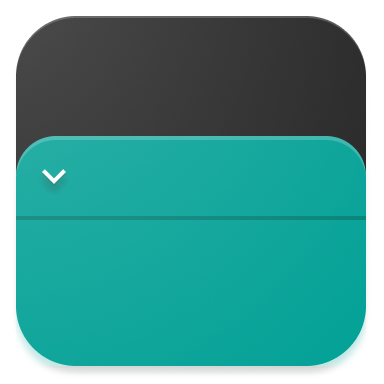

# Sheets

<p>

  

  <p>

流畅的对话框和底部表单，可在你的应用程序中快速使用，选择一个可用的表或在现有功能的基础上建立自定义表

   <a href="https://search.maven.org/search?q=g:%22com.maxkeppeler.sheets%22">
     
   </a>

   <a href="https://github.com/maxkeppeler/sheets">
     
   </a>

   <a href="https://www.apache.org/licenses/LICENSE-2.0">
     
   </a>

<a href="https://github.com/maxkeppeler/sheets">
  
</a>

<a href="https://github.com/maxkeppeler/sheets/fork">
  
</a>

<a href="https://github.com/maxkeppeler/sheets">
  
</a>

<a href="https://github.com/maxkeppeler/">
  
</a>

<a href="https://twitter.com/intent/tweet?text=Checkout%20this%20beautiful%20library!%20%23android%20%23androiddev%20%23library%20%40maxkeppeler%20%0A%0Ahttps%3A%2F%2Fgithub.com%2Fmaxkeppeler%2Fsheets">
  
</a>

<a href="https://twitter.com/maxkeppeler">
  
</a>

  </p>
</p>

[English](README.md) [简体中文](README.zh_CN.md).


## 目录

- [Get started](#get-started)
  - [Info Sheet](#info)
  - [Options Sheet](#options)
  - [Clock Time Sheet](#clock-time)
  - [Time Sheet](#time)
  - [Input Sheet](#input)
  - [Calendar Sheet](#calendar)
  - [Color Sheet](#color)
  - [Custom Sheet](#custom)
  - [Lottie](#lottie)
  - [Appearance](#appearance)
- [Misc](#misc)
  - [Showcase](#showcase)
  - [Support this project](#support-this-project)
  - [Credits](#credits)
  - [License](#license)

# 开始

一个 `sheet` 可以动态地显示为一个对话框或一个底部表单

[例子](https://github.com/MaxKeppeler/sheets/blob/main/sample/sample.apk).

你必须使用 `core` 模块，因为它是任何工作表的基础

在 `build.gradle` 中:

```gradle
repositories {
  ...
  mavenCentral()
}
```

在 app `build.gradle` 中:

[  ](https://search.maven.org/artifact/com.maxkeppeler.sheets/core)

```gradle
dependencies {
  ...
  implementation 'com.maxkeppeler.sheets:core:<latest-version>'
}
```

**基础功能** <br/>
以下函数可以从任何类型的表中调用.

| 方法                   | 功能                                                                             |
|-----------------------|----------------------------------------------------------------------------------|
| style()               | 显示为对话框或者底层表单 |
| title()               | 设置标题文本 |
| titleColor()          | 设置标题文本颜色 |
| titleColorRes()       | 通过一个 `Resource` 来设置标题文本颜色 |
| withCoverImage()      | 添加一个封面图片|
| topStyle()            | 指定封面图片和 `topBar` 的样式 |
| positiveButtonStyle() | 定义确认按钮的样式（文本、填充、轮廓) |
| negativeButtonStyle() | 定义否定按钮的样式（文本、填充、轮廓）|
| withIconButton()      | 在 `topBar` 中最多添加3个图标按钮 |
| closeIconButton()     | 设置一个自定义的 `closeIconButton` |
| displayHandle()       | 显示可调节窗口大小的控件（位于右下角） |
| displayCloseButton()  | 显示 `closeIconButton` |
| displayToolbar()      | 显示工具栏 (`closeIconButton`, `title`, `divider` and `icon` `buttons`) |
| peekHeight()          | Set the peek height. (Only bottom-sheet)|
| cornerRadius()        | 设置转角半径 |
| cornerFamily()        | 设置转角的样式 （裁剪或圆角）|
| borderWidth()         | 设置边框宽度 |
| borderColor()         | 设置边框颜色 |
| cancelableOutside()   | 使 `sheet` 可以在对话框视图之外取消 |
| onNegative()          | 设置否定按钮的文本和监听|
| onPositive()          | 设置确认按钮的文本和监听|
| onDismiss()           | 设置一个监听器，当 `sheet` 被撤消时被调用|
| onCancel()            | 设置一个监听器，当 `sheet` 被取消时被调用（仅当可取消时）|
| onClose()             | 设置一个监听器，当 `sheet` 关闭时被调用|
| show()                | show the sheet|

每个工作表都有一个扩展功能，叫做 `build `和 `show`。<br/>

使用 `build` 来构建一个 sheet 并在之后显示出来。

    val sheet = InfoSheet().build(context) {
      // build sheet
    }

    sheet.show() // Show sheet when ready

如果你想构建它，并且立刻显示出来，请使用 `show`

    InfoSheet().show(context) {
      // build sheet
    } // Show sheet

## Info

[  ](https://search.maven.org/artifact/com.maxkeppeler.sheets/core)

`Info sheet` 可以让你显示信息或警告

<details open>
<br/>
<br/>
<summary>Dialog 的演示</summary>

<br/>
<br/>
<br/>
<br/>

</details>
</br>

<details>
<summary>BottomSheet 的演示</summary>

<br/>
<br/>
<br/>
<br/>
<br/>
<br/>
</details>

```gradle
dependencies {
  ...
  implementation 'com.maxkeppeler.sheets:info:<latest-version>'
}
```

### 使用方法

对于默认的 `info sheet`，使用方法如下：

    InfoSheet().show(context) {
      title("Do you want to install Awake?")
      content("Awake is a beautiful alarm app with morning challenges, advanced alarm management and more.")
      onNegative("No") {
        // Handle event
      }
      onPositive("Install") {
        // Handle event
      }
    }

| 方法       | 行为           |
| --------------- | ------------------- |
| content()       | 设置内容文本   |
| drawable()      | Set drawable.       |
| drawableColor() | Set drawable color. |
| customView() | Use a custom view. |

## Options

[  ](https://search.maven.org/artifact/com.maxkeppeler.sheets/options)

`Options sheet` 可以让你显示一个网格或选项列表.

<details open>
<br/><br/>
<summary>Dialog 的演示</summary>


</details>
</br>

<details>
<br/><br/>
<summary>BottomSheet 的演示</summary>


</details>

<br/>
<details>
<br/><br/>
<summary>以对话框的方式展示一些不同的风格</summary>

<br/>
<br/>
<br/>

</details>
</br>

<details>
<br/><br/>
<summary>以 `BottomSheet` 的方式展示一些不同的风格</summary>

<br/>
<br/>
<br/>

</details>

```gradle
dependencies {
  ...
  implementation 'com.maxkeppeler.sheets:info:<latest-version>'
}
```

```gradle
dependencies {
  ...
  implementation 'com.maxkeppeler.sheets:options:<latest-version>'
}
```

### 使用方法

对于默认的 `options sheet`，按以下方式使用：

    OptionsSheet().show(context) {
      title("Text message")
      with(
        Option(R.drawable.ic_copy, "Copy"),
        Option(R.drawable.ic_translate, "Translate"),
        Option(R.drawable.ic_paste, "Paste")
      )
      onPositive { index: Int, option: Option ->
        // Handle selected option
      }
    }

| Function                     | Action                                                                                 |
| ---------------------------- | -------------------------------------------------------------------------------------- |
| multipleChoices()            | 允许多选内容|
| displayMultipleChoicesInfo() | 显示多项选择的信息|
| maxChoicesStrictLimit()      | Specify that the max choices is strict and more choices can't be selected temporarily. |
| minChoices()                 | 设置选择的最小数量|
| maxChoices()                 | 设置最大的选择数量|
| onPositiveMultiple()         | 设置多重选择的监听器|
| displayButtons()             | 显示按钮，并且需要一个确认按钮点击进行选择
| displayMode()                | 以 list/vertical/horizontal 的可滚动网格显示选项|
| preventIconTint()                | (Global) Prevents the lib to use a tint for the icons. Keeps the default colors of a drawable.           |

**可选的**

| 方法   | 行为 |
| ---------- | -------------------- |
| selected() | 预先选择一个选项|
| disable()  | 禁用一个选项|
| preventIconTint()                | (Local) Prevents the lib to use a tint for the icons. Keeps the default colors of a drawable.           |

**注意**。预选的选项会自动增加当前的选择，而禁用的选项会减少最大的选择数量。

## Clock Time

[  ](https://search.maven.org/artifact/com.maxkeppeler.sheets/time-clock)

`Clock Time` sheet 可以让你快速的选择时间

<details>
<br/><br/>
<summary>Dialog 的演示</summary>


</details>
</br>

<details open>
<br/><br/>
<summary>BottomSheet 的演示</summary>


</details>

```gradle
dependencies {
  ...
  implementation 'com.maxkeppeler.sheets:time-clock:<latest-version>'
}
```

### 使用方法

对于默认的 `Clock time` sheet，以 `24` 小时的格式，使用方法如下：

    ClockTimeSheet().show(context) {
      title("Wake-up time")
      onPositive { clockTimeInMillis: Long ->
        // Handle selected time
      }
    }

| Function        | Action                                |
| --------------- | ------------------------------------- |
| format24Hours() | 使用 24 小时格式或者 12 小时格式。     |
| currentTime()   | 以毫秒为单位设置当前时间。 |

## Time

[  ](https://search.maven.org/artifact/com.maxkeppeler.sheets/time)

`Time` sheet 可以让你以特定的格式选择一个持续时间。

<details open>
<br/><br/>
<summary>Dialog 的演示</summary>


</details>
</br>

<details>
<br/><br/>
<summary>BottomSheet 的演示</summary>


</details>

```gradle
dependencies {
  ...
  implementation 'com.maxkeppeler.sheets:time:<latest-version>'
}
```

### 使用方法

对于默认的 `Time` sheet，按以下方式使用。

    TimeSheet().show(context) {
      title("Snooze time")
      onPositive { durationTimeInMillis: Long ->
        // Handle selected time
      }
    }

| Function      | Action                                          |
| ------------- | ----------------------------------------------- |
| format()      | 选择时间格式。(hh:mm:ss, mm:ss, ...) |
| currentTime() | 设置当前时间，以秒为单位。                |
| minTime()     | 设置最短的时间。                           |
| maxTime()`    | 设置最长时间。                          |

## Input

[  ](https://search.maven.org/artifact/com.maxkeppeler.sheets/input)

`input sheet` 可以让你显示一个由各种 input 组成的表单:

<details>
<br/><br/>
<summary>Dialog 的演示</summary>


</details>
</br>

<details open>
<br/><br/>
<summary>BottomSheet 的演示</summary>


</details>

<br/>
<details>
<br/><br/>
<summary>一些关于 `Dialogs` 的其他形式</summary>

<br/>

</details>
</br>

<details>
<br/><br/>
<summary>一些关于 `BottomSheet` 的其他形式</summary>


</details>

```gradle
dependencies {
  ...
  implementation 'com.maxkeppeler.sheets:input:<latest-version>'
}
```

### 使用方法

对于默认的 `input sheet`，按以下方式使用：

    InputSheet()).show(context) {
        title("Short survey")
        content("We would like to ask you some questions reading your streaming platform usage.")
      with(InputEditText {
        required())
        label("Your favorite TV-Show")
        hint("The Mandalorian, ...")
        validationListener { value -> } // 添加自定义验证逻辑
        changeListener { value -> } // 输入的值被改变时
        resultListener { value -> } // 当表单完成后输入的值被改变时
      })
      with(InputCheckBox("binge_watching") { // Read value later by index or custom key from bundle
        label("Binge Watching")
        text("I'm regularly binge watching shows on Netflix.")
        // ... more options
      })
      with(InputRadioButtons() {
        required()
        label("Streaming service of your choice")
        options(mutableListOf("Netflix", "Amazon", "Other"))
      })
      // ... more input options
      onNegative { showToast("InputSheet cancelled", "No result") }
      onPositive { result ->
          showToastLong("InputSheet result", result.toString())
          val text = result.getString("0") // Read value of inputs by index
          val check = result.getBoolean("binge_watching") // Read value by passed key
      }
    }

| 函数  | 功能                                       |
| --------- | --------------------------------------------- |
| with()    | 添加一个 input。(见输入选项)             |
| content() | 设置内容文本。(例如，解释一项调查 |

**Input options:**

- `InputEditText`
- `InputCheckBox`
- `InputRadioButtons`
- `InputSpinner`

**Input**<br/>

| 函数         | 功能                           |
| ---------------- | -------------------------------- |
| label()          | 设置标签文本           |
| drawable()       | Set the drawable.                |
| required()       | Mark input as required.          |
| changeListener() | 设置监听器来观察变化。 |
| resultListener() | 为最终值设置监听器。   |

**InputEditText**<br/>

| 函数             | 功能                                            |
| -------------------- | ------------------------------------------------- |
| hint()               | 设置 hint 文本。                                |
| defaultValue()       | 设置默认文本。                                 |
| inputType()          | Set the `android.text.InputType`'s。               |
| inputFilter()        | Set the `android.text.inputFilter`                |
| maxLines()           | 设置最大行数。                      |
| endIconMode()        | Set TextInputLayout.EndIconMode。                  |
| endIconActivated()   | Set the EndIcon activated。                        |
| passwordVisible()    | 使密码最初可见或不可见。 |
| validationListener() | 用你自己的逻辑验证文本输入。      |

**InputCheckBox** <br/>

| 函数       | 功能             |
| -------------- | ------------------ |
| text()         | 设置文本。     |
| defaultValue() | 设置默认的值。 |

**InputRadioButtons** <br/>

| 函数   | 功能                             |
| ---------- | ---------------------------------- |
| options()  | 设置一个RadioButton的选项列表。 |
| selected() | 设置一个选定的索引。              |

**InputSpinner** <br/>

| 函数          | 功能                                                   |
| ----------------- | --------------------------------------------------------- |
| noSelectionText() | 设置在没有选择时显示的文本。 |
| options()         | 设置一个选项列表。                                    |
| selected()        | 设置一个选定的索引。                                     |

## Calendar

[  ](https://search.maven.org/artifact/com.maxkeppeler.calendar/core)

`Calendar` 表可以让你选择一个日期或日期范围。这种类型是使用 [CalendarView](https://github.com/kizitonwose/CalendarView) 库

<details open>
<br/><br/>
<summary>Dialog 的演示</summary>


</details>
</br>

<details>
<br/><br/>
<summary>BottomSheet 的演示</summary>


</details>

```gradle
dependencies {
  ...
  implementation 'com.maxkeppeler.sheets:calendar:<latest-version>'
}
```

### 使用方法

对于默认的 `time` sheet，按以下方式使用。

    CalendarSheet().show(this) { // Build and show
      title("What's your date of birth?") // Set the title of the sheet
      onPositive { dateStart, dateEnd ->
        // Handle date or range
      }

| 函数         | 功能                                                           |
| ----------------- | ---------------------------------------------------------------- |
| selectionMode()   | 选择选择模式（日期或范围）。                      |
| calendarMode()    | 选择日历模式（有许多行的星期或者是月视图）。 |
| disableTimeline() | 禁用过去或未来的日期。                            |
| rangeYears()      | 将年份范围设定为过去和未来。                    |
| disable()         | 传递一个 `Calendar` 对象，使各种日期不能被选择。 |
| displayButtons()  | 显示或隐藏按钮视图。                                   |

## Color

[  ](https://search.maven.org/artifact/com.maxkeppeler.sheets/color)

`Color` sheet 可以让你挑选颜色。显示默认的 `Material Colors` 或指定可以选择的颜色。你也可以允许选择一个自定义的颜色。

<details>
<br/><br/>
<summary>Dialog 的演示</summary>

<br/>


</details>
</br>

<details open>
<br/><br/>
<summary>BottomSheet 的演示</summary>

<br/>


</details>

```gradle
dependencies {
  ...
  implementation 'com.maxkeppeler.sheets:color:<latest-version>'
}
```

### 使用方法

对于默认的 `Color` sheet，按以下方式使用。

    ColorSheet().show(context) {
      title("Background color")
      onPositive { color ->
        // Use color
      }
    }

| 函数                 | 功能                                                          |
| ------------------------ | ---------------------------------------------------------------- |
| defaultView()            | 选择默认的颜色视图（来自模板或自定义的颜色）。 |
| disableSwitchColorView() | 禁用以在颜色视图之间切换。                           |
| defaultColor()           | 设置默认的选定颜色。                                      |
| colors()                 | 传递要在颜色模板视图中显示的所有颜色     |
| disableAlpha()           | 禁用自定义颜色的 alpha 颜色。                         |

## 自定义

只需使用 `Core` 模块，你就能在这个库的基础上创建自己的 sheet。你可以在你自己的自定义表单中自动使用一些组件和样式。默认情况下，带有逻辑的按钮和工具栏视图可随时由您自己的实现使用。

<details>
<br/><br/>
<summary>Dialog 的演示</summary>


</details>
</br>

<details open>
<br/><br/>
<summary>BottomSheet 的演示</summary>


</details>

```gradle
dependencies {
  ...
  implementation 'com.maxkeppeler.sheets:core:<latest-version>'
}
```

### 开始

你可以在样本模块中找到一个自定义表的实现。

1.  创建一个类，并从 `Sheet` 类中扩展。

    class CustomSheet : Sheet() {

2.  重写 `onCreateLayoutView` 方法并传递你的自定义布局。

    override fun onCreateLayoutView(): View {
    return LayoutInflater.from(activity).inflate(R.layout.sheets_custom, null)
    }

所有的基本功能都可以使用，在此基础上，你可以按照自己的意愿扩展逻辑和行为。

### 组件

你可以自由地使用这个库的表单类型所使用的组件。

- `SheetsTitle`
- `SheetsContent`
- `SheetsDigit`
- `SheetsNumericalInput`
- `SheetsDivider`
- `SheetsButton`
- `SheetsEdit`
- `SheetsRecyclerView`
- `SheetsValue`

## Lottie

[](https://search.maven.org/artifact/com.maxkeppeler.sheets/lottie)

`Lottie`模块让你有能力使用 [Lottie 动画](https://airbnb.design/lottie/) 作为封面视图。

<details open>
<br/>
<br/>
<summary>Dialog 的演示</summary>


</details>
</br>

<details>
<summary>BottomSheet 的演示</summary>

<br/>
<br/>

</details>

```gradle
dependencies {
  ...
  implementation 'com.maxkeppeler.sheets:lottie:<latest-version>'
}
```

### 使用方法

你可以用 `Lottie 动画` 作为任何 `sheet` 类型的封面。

    InfoSheet().show(this) {
      title("Team Collaboration")
      content("In the world of software projects, it is inevitable...")
      ...
      withCoverLottieAnimation(LottieAnimation {
        setAnimation(R.raw.anim_lottie_business_team)
        ... Setup Lottie animation
      })
      ...
    }

| 函数              | 功能                |
| ---------------------- | --------------------- |
| playCoverAnimation()   | 播放动画。   |
| resumeCoverAnimation() | 恢复动画。 |
| pauseCoverAnimation()  | 暂停动画。  |
| cancelCoverAnimation() | 取消动画。 |

## 外观

默认情况下，该库会根据 attr `textColorPrimary` 切换到白天或夜晚模式。
默认情况下，它使用 `activity` 的 `colorPrimary`。默认的 `highlightColor` 是根据 `sheetPrimaryColor` 的颜色生成的，如果没有 `colorPrimary`，则使用 `colorPrimary`。

### Base

你想要一个不同的背景形状？
那么只要覆盖 `Corner family` 和 `radius` 就可以了。

    <item name="sheetsCornerRadius">12dp</item>
    <item name="sheetsCornerFamily">cut</item>

如果你想实现与你的应用程序不同的 `sheets` 外观，只需要重写基础颜色。

    <item name="sheetsPrimaryColor">@color/customPrimaryColor</item>
    <item name="sheetsHighlightColor">@color/customHighlightColor</item>
    <item name="sheetsBackgroundColor">@color/customBackgroundColor</item>
    <item name="sheetsDividerColor">@color/customDividerColor</item>
    <item name="sheetsIconsColor">@color/customIconsColor</item>

你可以重写一个 `sheet` 的基本风格。你可以不显示 `Toolbar`，而是直接隐藏它，显示 `typical handle`

    <item name="sheetsDisplayHandle">true</item>
    <item name="sheetsDisplayToolbar">false</item>
    <item name="sheetsDisplayCloseButton">false</item>

改变标题的外观。

    <item name="sheetsTitleColor">@color/customTitleTextColor</item>
    <item name="sheetsTitleFont">@font/font</item>
    <item name="sheetsTitleLineHeight">@dimen/dimen</item>
    <item name="sheetsTitleLetterSpacing">value</item>

改变内容文本的外观。

    <item name="sheetsContentColor">@color/customContentTextColor</item>
    <item name="sheetsContentInverseColor">@color/customContentTextInverseColor</item>
    <item name="sheetsContentFont">@font/font</item>
    <item name="sheetsContentLineHeight">@dimen/dimen</item>
    <item name="sheetsContentLetterSpacing">value</item>

改变 `Text` 值的外观。例如，在 `TimeSheet` 和 `ClockTimeSheet` 中的时间或 `Calendarsheet` 中的选定日期和时期）。

    <item name="sheetsValueTextActiveColor">@color/customValueTextColor</item>
    <item name="sheetsValueFont">@font/font</item>
    <item name="sheetsValueLineHeight">@dimen/dimen</item>
    <item name="sheetsValueLetterSpacing">value</item>

改变数字输入的数字键的外观。

    <item name="sheetsDigitColor">@color/customDigitTextColor</item>
    <item name="sheetsDigitFont">@font/font</item>
    <item name="sheetsDigitLineHeight">@dimen/dimen</item>
    <item name="sheetsDigitLetterSpacing">value</item>

### 按钮

重写按钮文本的外观。

    <item name="sheetsButtonTextFont">@font/font</item>
    <item name="sheetsButtonTextLetterSpacing">value</item>

重写按钮的一般外观（取消和确认按钮）。

    <item name="sheetsButtonColor">@color/customButtonColor<item>
    <item name="sheetsButtonTextFont">@font/font<item>
    <item name="sheetsButtonTextLetterSpacing">value<item>
    <item name="sheetsButtonCornerRadius">12dp<item>
    <item name="sheetsButtonCornerFamily">cut<item>
    <item name="sheetsButtonWidth">match_content/wrap_content<item>

重写取消按钮的外观。

    <item name="sheetsNegativeButtonType">text_button/outlined_button/button<item>
    <item name="sheetsNegativeButtonCornerRadius">12dp<item>
    <item name="sheetsNegativeButtonCornerFamily">cut<item>

重写确认按钮的外观。

    <item name="sheetsPositiveButtonType">text_button/outlined_button/button<item>
    <item name="sheetsPositiveButtonCornerRadius">12dp<item>
    <item name="sheetsPositiveButtonCornerFamily">cut<item>

重写 `Outlined` 按钮的边界外观。

    <item name="sheetsButtonOutlinedButtonBorderColor">@color/borderColor<item>
    <item name="sheetsButtonOutlinedButtonBorderWidth">1dp<item>

`Corner family` 和 `radius` 会被应用到按钮的形状上，如果是 `Outlined` 或文本按钮，则应用到波纹背景形状上。

**精准控制**

您甚至可以为每个角定义 `Corner family` 以及取消和确认按钮的 `radius`。

    <item name="sheetsNegativeButtonBottomLeftCornerRadius">4dp<item>
    <item name="sheetsNegativeButtonBottomLeftCornerFamily">cut<item>
    ...
    <item name="sheetsPositiveButtonBottomRightCornerRadius">8dp<item>
    <item name="sheetsPositiveButtonBottomRightCornerFamily">rounded<item>

### Handle

The size and the appearance of the handle can be changed like this:

    <item name="sheetsHandleCornerRadius">8dp</item>
    <item name="sheetsHandleCornerFamily">rounded</item>
    <item name="sheetsHandleFillColor">?sheetPrimaryColor</item>
    <item name="sheetsHandleBorderColor">?sheetPrimaryColor</item>
    <item name="sheetsHandleBorderWidth">1dp</item>
    <item name="sheetsHandleWidth">42dp</item>
    <item name="sheetsHandleHeight">4dp</item>

### 可选 sheet

重写所选选项的外观。

    <item name="sheetsOptionSelectedImageColor">@color/customSelectedOptionImageColor</item>
    <item name="sheetsOptionSelectedTextColor">@color/customSelectedOptionTextColor</item>

重写禁用选项的外观。

    <item name="sheetsOptionDisabledImageColor">@color/customDisabledOptionImageColor</item>s
    <item name="sheetsOptionDisabledTextColor">@color/customDisabledOptionImageColor</item>
    <item name="sheetsOptionDisabledBackgroundColor">@color/customDisabledOptionBackgColor</item>

### InputSheet

重写 TextInputLayout（用于 InputEditText ）的外观。

    <item name="sheetsTextInputLayoutCornerRadius">12dp</item>
    <item name="sheetsTextInputLayoutBottomLeftCornerRadius">12dp</item>
    ... and for all other corners
    <item name="sheetsTextInputLayoutEndIconColor">@color/customEndIconColor</item>
    <item name="sheetsTextInputLayoutHelperTextColor">@color/customHelperTextColor</item>
    <item name="sheetsTextInputLayoutBoxStrokeColor">@color/customBoxStrokeColor</item>
    <item name="sheetsTextInputLayoutHintTextColor">@color/customHintTextColor</item>
    <item name="sheetsTextInputLayoutBoxStrokeErrorColor">@color/customBoxStrokeErrorColor</item>
    <item name="sheetsTextInputLayoutErrorTextColor">@color/customErrorTextColor</item>

# 杂项

## 展示

请看一些已经使用这个库的 app。<br/>
请随时联系我，把你的应用程序放在这里。

- [Sign for Spotify](https://play.google.com/store/apps/details?id=com.mk.sign.spotifyv2) - `Spotify` 的播放列表和控制部件在你的主屏幕上。(使用了: `Info`, `Options`, `Input`, `Color`)

- [Buddha Quotes](https://play.google.com/store/apps/details?id=org.bandev.buddhaquotes) - 一个合作的项目，旨在为 `Android` 创建一个免费和开源的 `Buddha Quotes` 应用程序，重点关注隐私。(使用了: `Options`, `Input`, `Color`, `Time`)

## 支持本项目

- 点一颗 **Star** 并且告诉其他的开发者

- **Watch** 进行更新和改进。

- **[Open an issue](https://github.com/MaxKeppeler/sheets/issues/)** 如果你看到或者发现任何的错误。

- 在[此处](https://github.com/MaxKeppeler/sheets/discussions/categories/show-and-tell)表示感谢，并展示您的实现。

## 激励

最近几个月，我为我的应用程序 [Sign for Spotify](https://play.google.com/store/apps/details?id=com.mk.sign.spotifyv2) 和 [Awake](https://play.google.com/store/apps/details?id=com.mk.awake) 创建了几个 Sheet.

我特别想有一个以 sheet 的形式的 `Writable` 的时钟时间和持续时间选择器。
这是我的第一个库-- 我很高兴得到任何反馈和提示等。我希望你喜欢它并且能够使用它。)

## Credits

- 感谢 [Sasikanth](https://github.com/msasikanth) 通过 [Color Sheet](https://github.com/msasikanth/ColorSheet) 和 [Memoire](https://play.google.com/store/apps/details?id=com.primudesigns.stories) 提供的关于 sheet 外观的灵感
- 感谢 [Aidan Follestad](https://github.com/afollestad) 和他的 [material-dialogs](https://github.com/afollestad/material-dialogs) 库，让这个库模块化。

## License

    Copyright 2020 Maximilian Keppeler https://maxkeppeler.com

    Licensed under the Apache License, Version 2.0 (the "License");
    you may not use this file except in compliance with the License.
    You may obtain a copy of the License at

       http://www.apache.org/licenses/LICENSE-2.0

    Unless required by applicable law or agreed to in writing, software
    distributed under the License is distributed on an "AS IS" BASIS,
    WITHOUT WARRANTIES OR CONDITIONS OF ANY KIND, either express or implied.
    See the License for the specific language governing permissions and
    limitations under the License.
